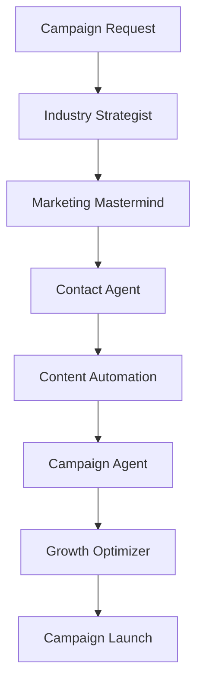
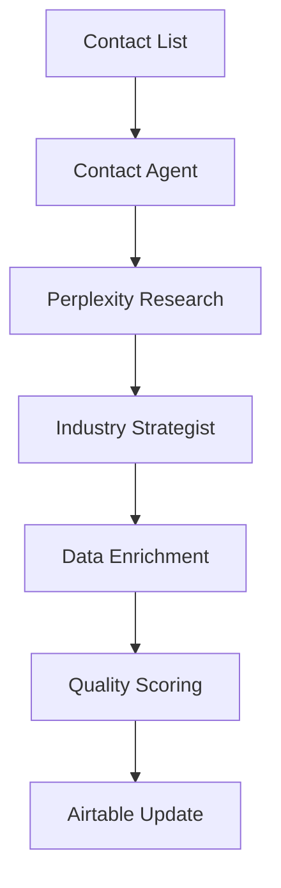

# Total Audio Promo - AI Agents Guide

## Overview
The AI Agents system provides intelligent automation for music promotion workflows using multiple AI services including Claude AI, Perplexity, and custom orchestration logic.

## Agent Architecture

### **Core Components**
```
tools/agents/
 orchestrator.js           # Main orchestration engine
 setup.js                 # Agent setup and configuration
 music-tech-agent.js      # Music technology specialist
 growth-hacking-optimizer.js  # Growth optimization
 music-industry-strategist.js # Industry strategy
 music-marketing-mastermind.js # Marketing automation
 viral-content-automation.js  # Content generation
 campaign-agent.js        # Campaign management
 contact-agent.js         # Contact research
 integration-agent.js     # Integration management
```

### **Agent Types**

#### **1. Music Technology Agent**
- **Purpose**: Audio analysis, technical recommendations
- **Capabilities**: 
  - Audio file analysis
  - Technical performance optimization
  - Music format recommendations
  - Quality assessment

#### **2. Growth Hacking Optimizer**
- **Purpose**: Data-driven growth strategies
- **Capabilities**:
  - A/B testing recommendations
  - Conversion optimization
  - User acquisition strategies
  - Retention analysis

#### **3. Industry Strategist**
- **Purpose**: Music industry insights and strategy
- **Capabilities**:
  - Market trend analysis
  - Competitive intelligence
  - Industry relationship mapping
  - Strategic planning

#### **4. Marketing Mastermind**
- **Purpose**: Campaign optimization and automation
- **Capabilities**:
  - Campaign performance analysis
  - Audience targeting
  - Channel optimization
  - ROI maximization

#### **5. Viral Content Automation**
- **Purpose**: Content generation and optimization
- **Capabilities**:
  - Social media content creation
  - Email template generation
  - Press release writing
  - Content performance prediction

## Agent Configuration

### **Environment Setup**
```env
# AI Service API Keys
ANTHROPIC_API_KEY=your-claude-api-key
PERPLEXITY_API_KEY=your-perplexity-api-key
OPENAI_API_KEY=your-openai-api-key

# Agent Configuration
AGENT_LOG_LEVEL=info
AGENT_MAX_RETRIES=3
AGENT_TIMEOUT=30000

# Orchestrator Settings
ORCHESTRATOR_ENABLED=true
ORCHESTRATOR_INTERVAL=300000  # 5 minutes
```

### **Agent Setup Commands**
```bash
# Initialize all agents
npm run agents:setup

# Check agent configuration
npm run agents:check

# Test agent connections
npm run agents:test

# Monitor agent health
npm run agents:health
```

## Agent Workflows

### **Campaign Creation Workflow**


### **Contact Research Workflow**


## Agent Implementation

### **Base Agent Class**
```javascript
class BaseAgent {
  constructor(config) {
    this.config = config;
    this.name = this.constructor.name;
    this.logger = new Logger(this.name);
  }

  async execute(task) {
    try {
      this.logger.info(`Starting task: ${task.type}`);
      const result = await this.processTask(task);
      this.logger.info(`Completed task: ${task.type}`);
      return result;
    } catch (error) {
      this.logger.error(`Task failed: ${error.message}`);
      throw error;
    }
  }

  async processTask(task) {
    // Override in subclasses
    throw new Error('processTask must be implemented');
  }

  async healthCheck() {
    return {
      agent: this.name,
      status: 'healthy',
      timestamp: new Date().toISOString()
    };
  }
}
```

### **Music Technology Agent Example**
```javascript
class MusicTechAgent extends BaseAgent {
  async processTask(task) {
    switch (task.type) {
      case 'analyze':
        return await this.analyzeAudio(task.audioFile);
      case 'recommend':
        return await this.generateRecommendations(task.context);
      case 'optimize':
        return await this.optimizeSettings(task.parameters);
      default:
        throw new Error(`Unknown task type: ${task.type}`);
    }
  }

  async analyzeAudio(audioFile) {
    // Audio analysis implementation
    const analysis = {
      format: 'MP3',
      quality: 'High',
      duration: '3:45',
      bpm: 128,
      key: 'C Major',
      recommendations: [
        'Consider mastering for streaming platforms',
        'Optimize for radio play dynamics'
      ]
    };
    return analysis;
  }
}
```

## Orchestrator System

### **Orchestrator Configuration**
```javascript
// tools/agents/orchestrator.js
class AgentOrchestrator {
  constructor() {
    this.agents = new Map();
    this.workflows = new Map();
    this.taskQueue = [];
  }

  async registerAgent(agent) {
    this.agents.set(agent.name, agent);
    await agent.healthCheck();
  }

  async executeWorkflow(workflowName, context) {
    const workflow = this.workflows.get(workflowName);
    if (!workflow) {
      throw new Error(`Workflow not found: ${workflowName}`);
    }

    return await this.processWorkflow(workflow, context);
  }
}
```

### **Workflow Definitions**
```javascript
const workflows = {
  'campaign-creation': {
    steps: [
      { agent: 'IndustryStrategist', task: 'analyze-market' },
      { agent: 'MarketingMastermind', task: 'create-strategy' },
      { agent: 'ContactAgent', task: 'research-targets' },
      { agent: 'ContentAutomation', task: 'generate-content' },
      { agent: 'CampaignAgent', task: 'execute-campaign' }
    ]
  },
  'contact-enrichment': {
    steps: [
      { agent: 'ContactAgent', task: 'scrape-data' },
      { agent: 'IndustryStrategist', task: 'analyze-relevance' },
      { agent: 'ContactAgent', task: 'enrich-profile' },
      { agent: 'IntegrationAgent', task: 'update-airtable' }
    ]
  }
};
```

## Agent Commands

### **Setup and Management**
```bash
# Setup all agents
npm run agents:setup

# Check agent status
npm run agents:check

# Test agent functionality
npm run agents:test

# View agent health
npm run agents:health

# Run orchestrator workflows
npm run agents:workflows

# Maintenance mode
npm run agents:maintenance
```

### **Individual Agent Commands**
```bash
# Music Technology Agent
npm run agents:music-tech
npm run agents:music-analyze
npm run agents:music-search
npm run agents:music-performance
npm run agents:music-recommendations

# Marketing Agent
npm run agents:marketing-analyze
npm run agents:marketing-optimize

# Content Agent
npm run agents:content-generate
npm run agents:content-optimize
```

## Integration with Main System

### **API Integration**
```typescript
// apps/api/src/routes/agents.ts
router.post('/execute', async (req, res) => {
  const { agentName, task } = req.body;
  
  try {
    const agent = orchestrator.getAgent(agentName);
    const result = await agent.execute(task);
    res.json({ success: true, result });
  } catch (error) {
    res.status(500).json({ error: error.message });
  }
});
```

### **Database Integration**
```typescript
// Store agent results in database
const agentResult = await prisma.agentExecution.create({
  data: {
    agentName: agent.name,
    taskType: task.type,
    result: JSON.stringify(result),
    executionTime: Date.now() - startTime,
    status: 'completed'
  }
});
```

### **Real-time Updates**
```javascript
// Send real-time updates via Socket.io
socket.emit('agent-update', {
  agentName: agent.name,
  status: 'processing',
  progress: 50,
  message: 'Analyzing contact data...'
});
```

## AI Service Integration

### **Claude AI Integration**
```javascript
import Anthropic from '@anthropic-ai/sdk';

class ClaudeService {
  constructor() {
    this.client = new Anthropic({
      apiKey: process.env.ANTHROPIC_API_KEY
    });
  }

  async generateContent(prompt, context = {}) {
    const response = await this.client.messages.create({
      model: 'claude-3-opus-20240229',
      max_tokens: 1000,
      messages: [{
        role: 'user',
        content: prompt
      }]
    });

    return response.content[0].text;
  }
}
```

### **Perplexity Integration**
```javascript
class PerplexityService {
  constructor() {
    this.apiKey = process.env.PERPLEXITY_API_KEY;
    this.baseURL = 'https://api.perplexity.ai';
  }

  async research(query, options = {}) {
    const response = await fetch(`${this.baseURL}/chat/completions`, {
      method: 'POST',
      headers: {
        'Authorization': `Bearer ${this.apiKey}`,
        'Content-Type': 'application/json'
      },
      body: JSON.stringify({
        model: 'llama-3.1-sonar-small-128k-online',
        messages: [
          { role: 'user', content: query }
        ],
        ...options
      })
    });

    return await response.json();
  }
}
```

## Agent Monitoring

### **Health Monitoring**
```javascript
class AgentMonitor {
  constructor() {
    this.metrics = new Map();
  }

  async checkAllAgents() {
    const results = [];
    
    for (const [name, agent] of this.agents) {
      try {
        const health = await agent.healthCheck();
        results.push({ name, status: 'healthy', ...health });
      } catch (error) {
        results.push({ 
          name, 
          status: 'unhealthy', 
          error: error.message 
        });
      }
    }

    return results;
  }
}
```

### **Performance Metrics**
```javascript
const metrics = {
  executionTime: 1250,      // milliseconds
  successRate: 95.5,        // percentage
  tasksCompleted: 1247,     // count
  errors: 56,               // count
  avgResponseTime: 850      // milliseconds
};
```

## Error Handling

### **Agent Error Types**
```javascript
class AgentError extends Error {
  constructor(message, type, agent, recoverable = false) {
    super(message);
    this.type = type;
    this.agent = agent;
    this.recoverable = recoverable;
    this.timestamp = new Date();
  }
}

// Error types
const ERROR_TYPES = {
  CONFIGURATION: 'configuration',
  API_LIMIT: 'api_limit',
  NETWORK: 'network',
  PROCESSING: 'processing',
  VALIDATION: 'validation'
};
```

### **Retry Logic**
```javascript
async function executeWithRetry(agent, task, maxRetries = 3) {
  let lastError;
  
  for (let attempt = 1; attempt <= maxRetries; attempt++) {
    try {
      return await agent.execute(task);
    } catch (error) {
      lastError = error;
      
      if (!error.recoverable || attempt === maxRetries) {
        throw error;
      }
      
      const delay = Math.pow(2, attempt) * 1000; // Exponential backoff
      await new Promise(resolve => setTimeout(resolve, delay));
    }
  }
  
  throw lastError;
}
```

## Best Practices

### **Agent Development**
1. **Single Responsibility**: Each agent should have a clear, focused purpose
2. **Error Handling**: Implement comprehensive error handling and recovery
3. **Logging**: Use structured logging for debugging and monitoring
4. **Testing**: Write unit tests for agent logic
5. **Documentation**: Document agent capabilities and usage

### **Workflow Design**
1. **Modularity**: Design workflows as composable steps
2. **Fault Tolerance**: Handle individual step failures gracefully
3. **Monitoring**: Track workflow execution and performance
4. **Versioning**: Version workflows for backward compatibility

### **Performance Optimization**
1. **Caching**: Cache expensive operations and API calls
2. **Parallel Execution**: Run independent tasks in parallel
3. **Rate Limiting**: Respect API rate limits
4. **Resource Management**: Monitor memory and CPU usage

---

## Quick Reference

### **Agent Commands**
```bash
npm run agents:setup      # Initialize agents
npm run agents:health     # Check agent status
npm run agents:workflows  # Run orchestrator
npm run agents:test       # Test functionality
```

### **Key Files**
- `tools/agents/orchestrator.js` - Main orchestration
- `tools/agents/setup.js` - Configuration
- `docs/ai-agents/` - Agent documentation

### **Monitoring Endpoints**
- `/api/agents/health` - Agent health status
- `/api/agents/metrics` - Performance metrics
- `/api/agents/logs` - Recent agent logs