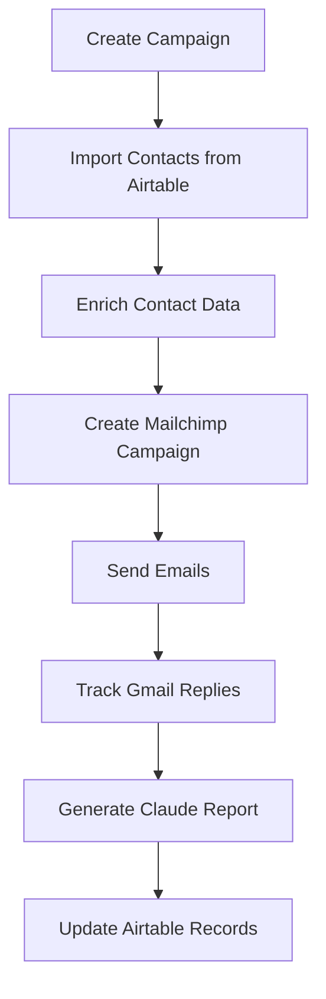
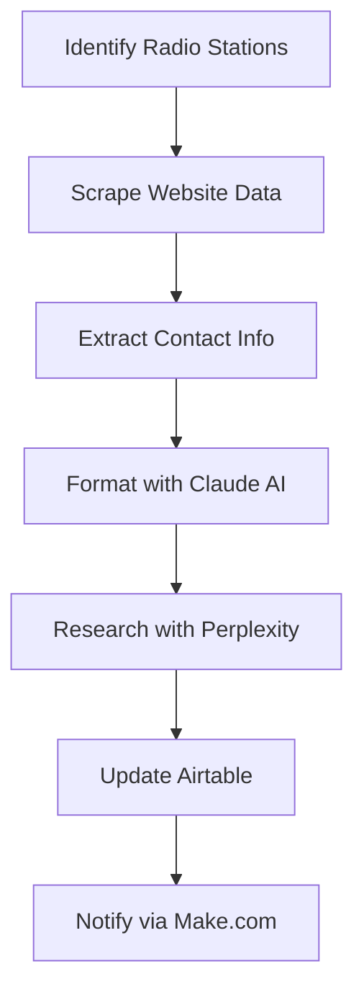

# Total Audio Promo - Integration Guide

## Overview

Total Audio Promo integrates with multiple third-party services to provide comprehensive music promotion automation. This guide covers all integrations and their configurations.

## Core Integrations

### 1. **Airtable Integration**

#### **Purpose**

- Contact database management
- Campaign tracking
- Data synchronization

#### **Configuration**

```env
AIRTABLE_API_KEY=your-airtable-api-key
AIRTABLE_BASE_ID=your-base-id
```

#### **Key Features**

- **Contact Sync**: Bidirectional contact synchronization
- **Campaign Records**: Track campaigns in Airtable
- **Data Enrichment**: Enhance contact records with scraped data
- **Audit Tools**: Data quality analysis and cleanup

#### **API Endpoints**

```typescript
POST /api/airtable/sync           # Sync contacts
POST /api/airtable/audit          # Audit data quality
POST /api/airtable/enrich         # Enrich contact data
POST /api/airtable/domain-analysis # Analyze domains
```

#### **Contact Enrichment Process**

```typescript
interface EnrichmentData {
  email: string;
  domain: string;
  stationName: string;
  websiteUrl: string;
  scrapedData: {
    format: string; // Music format preferences
    genres: string[]; // Accepted genres
    submissionGuidelines: string; // How to submit music
    contactPreferences: string; // Preferred contact method
    djNames: string[]; // DJ/presenter names
    showInfo: string[]; // Show information
    contactForms: string[]; // Contact form URLs
    socialMedia: string[]; // Social media profiles
    additionalContacts: string[]; // Additional contact info
    rawContent: string; // Raw scraped content
  };
  confidence: number; // Confidence score (0-100)
  errors: string[]; // Any errors encountered
  contactIntelligence: string; // Formatted summary
}
```

### 2. **Mailchimp Integration**

#### **Purpose**

- Email campaign creation and management
- Email analytics and tracking
- Audience segmentation

#### **Configuration**

```env
MAILCHIMP_API_KEY=your-mailchimp-api-key
MAILCHIMP_SERVER_PREFIX=us1
```

#### **Key Features**

- **Campaign Creation**: Automated email campaign setup
- **Audience Management**: Contact list synchronization
- **Analytics**: Open rates, click rates, unsubscribe tracking
- **Templates**: Branded email templates

#### **API Integration**

```typescript
// Create email campaign
POST /api/integrations/mailchimp/campaign
{
  "listId": "mailchimp_list_id",
  "subject": "New Music Release",
  "templateId": "template_123",
  "contacts": ["contact_1", "contact_2"]
}
```

### 3. **Gmail Integration**

#### **Purpose**

- Email reply tracking
- Direct email sending
- Engagement monitoring

#### **Configuration**

```env
GOOGLE_CLIENT_ID=your-google-client-id
GOOGLE_CLIENT_SECRET=your-google-client-secret
GOOGLE_REDIRECT_URI=http://localhost:3001/api/integrations/gmail/callback
GOOGLE_CLOUD_PROJECT=your-google-cloud-project
```

#### **OAuth Flow**

1. User initiates Gmail connection
2. Redirect to Google OAuth
3. Handle callback and store tokens
4. Enable email tracking

#### **Features**

- **Reply Detection**: Monitor email replies in real-time
- **Engagement Scoring**: Track interaction quality
- **Direct Sending**: Send emails through connected Gmail account

### 4. **Claude AI Integration**

#### **Purpose**

- Content generation
- Campaign analysis
- Performance insights

#### **Configuration**

```env
ANTHROPIC_API_KEY=your-anthropic-api-key
```

#### **Features**

- **Report Generation**: AI-powered campaign reports
- **Content Creation**: Email content and social media posts
- **Contact Analysis**: Analyze contact engagement patterns
- **Recommendations**: Strategic campaign suggestions

#### **API Usage**

```typescript
POST /api/claude/generate
{
  "type": "campaign_report",
  "campaignId": "campaign_123",
  "metrics": {
    "openRate": 45.2,
    "clickRate": 12.1,
    "replyRate": 5.8
  }
}
```

### 5. **Perplexity Integration**

#### **Purpose**

- AI-powered contact research
- Industry trend analysis
- Competitive intelligence

#### **Configuration**

```env
PERPLEXITY_API_KEY=your-perplexity-api-key
```

#### **Research Capabilities**

- **Contact Research**: Deep dive into contact background
- **Industry Analysis**: Music industry trends and insights
- **Competitive Intelligence**: Analyze competitor strategies
- **Market Research**: Identify new opportunities

### 6. **Make.com Integration**

#### **Purpose**

- Workflow automation
- Cross-platform connectivity
- Custom integrations

#### **Configuration**

```env
MAKE_WEBHOOK_URL=https://hook.make.com/your-webhook-url
MAKE_API_KEY=your-make-api-key
```

#### **Automation Workflows**

- **Campaign Triggers**: Automatic campaign creation
- **Data Sync**: Multi-platform data synchronization
- **Notification Systems**: Real-time alerts and updates
- **Custom Integrations**: Connect with additional services

### 7. **Stripe Integration**

#### **Purpose**

- Subscription management
- Payment processing
- Billing automation

#### **Configuration**

```env
STRIPE_SECRET_KEY=sk_test_your-stripe-secret-key
STRIPE_WEBHOOK_SECRET=whsec_your-webhook-secret
```

#### **Features**

- **Subscription Plans**: Artist and Agency tiers
- **Payment Processing**: Secure payment handling
- **Invoice Management**: Automated billing
- **Usage Tracking**: Monitor service usage

## Integration Workflows

### **Campaign Creation Workflow**



### **Contact Enrichment Workflow**



## Data Flow Architecture

### **Inbound Data**

- **Airtable**: Contact imports, campaign data
- **Gmail**: Email replies, engagement data
- **Mailchimp**: Campaign analytics, delivery status
- **Stripe**: Payment events, subscription changes

### **Outbound Data**

- **Airtable**: Enriched contact data, campaign results
- **Mailchimp**: Email campaigns, audience lists
- **Make.com**: Workflow triggers, notifications
- **Claude AI**: Content requests, analysis tasks

### **Real-time Sync**

- **Webhooks**: Real-time event processing
- **Socket.io**: Live dashboard updates
- **Redis**: Job queue management
- **Database**: Central data store with Prisma ORM

## Security & Authentication

### **API Key Management**

- All API keys stored in environment variables
- Rotation policies for enhanced security
- Access logging and monitoring

### **OAuth Flows**

- **Gmail**: OAuth 2.0 with refresh tokens
- **Secure Storage**: Encrypted token storage
- **Scope Management**: Minimal required permissions

### **Webhook Security**

- **Signature Verification**: All webhooks verify signatures
- **HTTPS Only**: Secure transport layer
- **Rate Limiting**: Prevent abuse

## Error Handling & Monitoring

### **Integration Failures**

```typescript
interface IntegrationError {
  service: 'airtable' | 'mailchimp' | 'gmail' | 'claude' | 'perplexity';
  operation: string;
  error: string;
  retryable: boolean;
  timestamp: Date;
}
```

### **Retry Logic**

- **Exponential Backoff**: Progressive retry delays
- **Max Retries**: Configurable retry limits
- **Dead Letter Queue**: Failed job handling

### **Monitoring**

- **Health Checks**: Regular service availability checks
- **Performance Metrics**: Response time monitoring
- **Error Alerting**: Real-time error notifications

## Development Setup

### **Local Development**

```bash
# Install dependencies
npm install

# Set up environment variables
cp .env.example .env

# Start development server
npm run dev:backend
```

### **Testing Integrations**

```bash
# Test Airtable connection
curl -X GET http://localhost:3001/api/integrations/airtable/test

# Test Mailchimp connection
curl -X GET http://localhost:3001/api/integrations/mailchimp/test

# Test Claude AI
curl -X POST http://localhost:3001/api/claude/test
```

### **Environment Configuration**

See individual integration sections for required environment variables.

## Troubleshooting

### **Common Issues**

#### **Airtable Connection**

- Verify API key and base ID
- Check field mappings
- Validate permissions

#### **Mailchimp Campaigns**

- Confirm audience permissions
- Check template availability
- Verify sender authentication

#### **Gmail Integration**

- Refresh OAuth tokens
- Check API quotas
- Verify webhook endpoints

### **Debugging Tools**

- **Logs**: Check service logs in `/logs/`
- **API Testing**: Use Postman collection
- **Health Endpoints**: Monitor `/health` endpoints

---

## Quick Reference

### **Integration Status Dashboard**

Access real-time integration status at `/api/integrations/status`

### **API Documentation**

- Full API docs: `/docs/API_REFERENCE.md`
- OpenAPI spec: `/docs/openapi.json`

### **Support Resources**

- Integration troubleshooting: `/docs/TROUBLESHOOTING.md`
- Development guide: `/docs/DEVELOPMENT.md`
